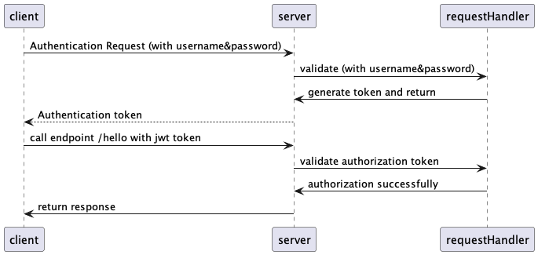

# java spring-boot jwt

* what is jwt
  * jwt (json token token), s a standard that is mostly used for securing REST APIs.
  * how to sign a toke
    * JWTs can be signed using a secret (with the HMAC algorithm) or a public/private key pair using RSA or ECDSA.
    * the structure of jwt
      * jwt token is componented by the following three parts (always like ***xxx.xxx.xxx***)
        * header, tell the service the type of the token and the encoding algorithm
          ```json
          {
            "alg": "HS256",
            "typ": "JWT"
          }
          ```
        * payload
          * different claim
            * Registered claims: issuer, expiration time, subject
            * Public claims: name
            * Private claims: 
        * signature
          * to encode the header, payload and secret
* why we use jwt
  * authentication
  * authorization
* how to use jwt token
  * the framework of jwt usage
  
  * code implementation
  
